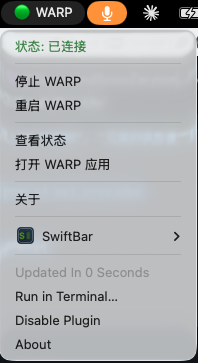

# SwiftBar WARP Control

**🚨 SOLVES: Cloudflare WARP stuck on/force-enabled - can't turn off issue**

**Professional macOS menu bar tool for password-free Cloudflare WARP VPN control**

A secure and efficient SwiftBar plugin that provides seamless Cloudflare WARP VPN management directly from your macOS menu bar. **Specifically designed to solve the common problem where Cloudflare WARP gets stuck in force-enabled mode and cannot be turned off through the normal interface.**

🔧 **Core Problem Solved**: When Cloudflare WARP enters a forced-on state and becomes unresponsive to disable commands through the GUI, this tool provides reliable command-line based control to force disconnect and regain control of your VPN connection.


## Features

### 🎯 Core Solution
- **Force Disable Stuck WARP**: Reliably turns off WARP when it's stuck in force-enabled mode
- **Bypass GUI Limitations**: Works when the official WARP app becomes unresponsive
- **Command-Line Reliability**: Uses robust CLI commands to ensure control works

### 🚀 User Experience  
- **Password-Free Control**: Toggle WARP on/off without entering your password repeatedly
- **One-Click Installation**: Automatically installs all dependencies including SwiftBar
- **Clean Interface**: Seamless menu bar integration with status indicators
- **Smart Detection**: Automatically detects WARP status and system requirements

### 🔒 Security & Reliability
- **Secure Design**: Minimal privilege escalation, only for WARP control commands  
- **Rich Menu Options**: Start, stop, restart, and status checking options
- **Easy Uninstall**: Complete removal with included uninstall script

## Screenshots



### Menu Bar Integration
```
🟢 WARP  (when connected)
🔴 WARP  (when disconnected)
```

### Menu Options
- **Status**: Connected/Disconnected with color indicators
- **Controls**: Start, Stop, Restart WARP
- **Utilities**: View status, open WARP app
- **Links**: Project homepage and documentation

## When You Need This Tool

### 🆘 Common WARP Problems This Solves:
- ❌ "WARP won't turn off" - when the toggle is grayed out
- ❌ "WARP stuck on" - when disconnecting doesn't work  
- ❌ "Can't disable WARP" - when GUI controls become unresponsive
- ❌ "WARP force enabled" - when enterprise/managed policies keep it on
- ❌ "WARP app frozen" - when the official app stops responding

### ✅ Why This Tool Works:
- **Direct CLI Control**: Bypasses GUI limitations using `warp-cli` commands
- **Force Disconnect**: Can terminate WARP connections that GUI can't stop
- **Administrative Override**: Uses elevated privileges to ensure control works
- **Process Management**: Can kill and restart WARP daemon if needed

## Requirements

- **macOS**: 10.15 (Catalina) or later
- **Cloudflare WARP**: Must be installed from App Store or official website
- **Admin Access**: Required for initial setup only

## Installation

Run this single command in Terminal:

```bash
curl -fsSL https://raw.githubusercontent.com/leeguooooo/swiftbar-warp-control/main/install.sh | bash
```

Or clone and install manually:

```bash
git clone https://github.com/leeguooooo/swiftbar-warp-control.git
cd swiftbar-warp-control
bash install.sh
```

## What Gets Installed

The installer automatically handles:

1. **Homebrew** (if not already installed)
2. **SwiftBar** (if not already installed)
3. **WARP Control Script** (`/usr/local/bin/warp-control.sh`)
4. **Sudo Configuration** (`/etc/sudoers.d/warp-toggle`)
5. **SwiftBar Plugin** (`~/swiftbar/warp.5s.sh`)
6. **SwiftBar Configuration** (automatic plugin directory setup)

## Security

This tool is designed with security in mind:

- **Minimal Privileges**: Only allows password-free execution of the specific WARP control script
- **User-Specific**: Permissions are granted only to the installing user
- **Isolated Commands**: No access to other system commands or sudo operations
- **Open Source**: Full code transparency for security review

The sudo configuration only allows:
```bash
username ALL=(ALL) NOPASSWD: /usr/local/bin/warp-control.sh
```

## Usage

After installation, the WARP control icon will automatically appear in your menu bar. **No manual configuration required** - the installer automatically sets up SwiftBar with the correct plugin directory.

### Status Indicators
- **🟢 WARP**: Connected and running
- **🔴 WARP**: Disconnected or stopped

### Menu Actions
- **Start WARP**: Connect to Cloudflare WARP
- **Stop WARP**: Disconnect from WARP
- **Restart WARP**: Restart the WARP connection
- **View Status**: See detailed connection status in terminal
- **Open WARP App**: Launch the official WARP application

### Command Line Usage

You can also control WARP directly from the terminal:

```bash
# Start WARP
sudo /usr/local/bin/warp-control.sh start

# Stop WARP
sudo /usr/local/bin/warp-control.sh stop

# Check status
sudo /usr/local/bin/warp-control.sh status

# Toggle on/off
sudo /usr/local/bin/warp-control.sh toggle
```

## Uninstall

To completely remove all components:

```bash
bash uninstall.sh
```

This will remove:
- WARP control script
- Sudo configuration
- SwiftBar plugin

*Note: SwiftBar and Cloudflare WARP applications are not automatically removed.*

## Manual Uninstall

If you need to manually remove components:

```bash
# Remove WARP control script
sudo rm -f /usr/local/bin/warp-control.sh

# Remove sudo configuration
sudo rm -f /etc/sudoers.d/warp-toggle

# Remove SwiftBar plugin
rm -f ~/swiftbar/warp.5s.sh
```

## Troubleshooting

### WARP doesn't start/stop
1. Ensure Cloudflare WARP is installed and working
2. Try running the control script manually:
   ```bash
   sudo /usr/local/bin/warp-control.sh status
   ```

### Menu bar icon doesn't appear
1. Check if SwiftBar is running
2. Restart SwiftBar application
3. If still not working, manually verify plugin directory in SwiftBar preferences (should be `~/swiftbar`)
4. Refresh SwiftBar plugins

### Permission denied errors
1. Verify sudoers configuration:
   ```bash
   sudo visudo -c -f /etc/sudoers.d/warp-toggle
   ```
2. Try logging out and back in
3. Reinstall using the install script

### SwiftBar plugin shows error
1. Check if the control script exists:
   ```bash
   ls -la /usr/local/bin/warp-control.sh
   ```
2. Verify script permissions:
   ```bash
   sudo chmod 755 /usr/local/bin/warp-control.sh
   ```

For more help, see [Troubleshooting Guide](docs/TROUBLESHOOTING.md)

## Updates

To update to the latest version:

```bash
# Pull latest changes
git pull origin main

# Reinstall
bash install.sh
```

## Contributing

Contributions are welcome! Please read our [Contributing Guidelines](CONTRIBUTING.md) first.

### Development Setup

```bash
# Clone the repository
git clone https://github.com/leeguooooo/swiftbar-warp-control.git
cd swiftbar-warp-control

# Test installation in development mode
bash install.sh
```

### Submitting Changes

1. Fork the repository
2. Create a feature branch
3. Make your changes
4. Test thoroughly
5. Submit a pull request

## License

This project is licensed under the MIT License - see the [LICENSE](LICENSE) file for details.

## Acknowledgments

- **[SwiftBar](https://github.com/swiftbar/SwiftBar)**: Powerful macOS menu bar customization
- **[Cloudflare WARP](https://1.1.1.1/)**: Fast, secure, and private internet connection
- **[BitBar](https://github.com/matryer/bitbar)**: The original inspiration for menu bar plugins

## Support

- **Bug Reports**: [GitHub Issues](https://github.com/leeguooooo/swiftbar-warp-control/issues)
- **Feature Requests**: [GitHub Discussions](https://github.com/leeguooooo/swiftbar-warp-control/discussions)
- **Documentation**: [Wiki](https://github.com/leeguooooo/swiftbar-warp-control/wiki)

## Sponsorship

If this project has been helpful to you, please consider supporting its development:

[](https://github.com/sponsors/leeguooooo)
[](https://ko-fi.com/leeguooooo)

Your sponsorship helps maintain and improve this project. Thank you for your support!

### Special Thanks to Our Sponsors

*Sponsors will be listed here. Be the first to support this project!*

## Star History

If this project helped you, please consider giving it a star!

[](https://star-history.com/#leeguooooo/swiftbar-warp-control&Date)

---

**Made with care for the macOS community**