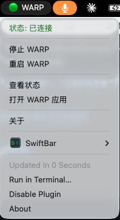

# Fix Cloudflare WARP Stuck On/Force Enabled Issue

**🚨 SOLVES: WARP Won't Turn Off, Stuck On, Force-Enabled Problems**

**Professional macOS menu bar tool for reliable Cloudflare WARP control**

When Cloudflare WARP gets **stuck in force-enabled mode** and won't turn off through the normal interface, this tool provides **reliable command-line based control** to force disconnect and regain control of your VPN connection. Specifically designed for the common problem where WARP becomes unresponsive to GUI controls.


## 🆘 Common WARP Problems This Solves

### When WARP Gets Stuck:
- ❌ **"WARP won't turn off"** - Toggle is grayed out or unresponsive
- ❌ **"WARP stuck on"** - Disconnect button doesn't work
- ❌ **"Can't disable WARP"** - GUI controls become frozen
- ❌ **"WARP force enabled"** - Enterprise policies prevent disconnection
- ❌ **"WARP app frozen"** - Official app stops responding

### ✅ Why Our Solution Works:
- **Direct CLI Control**: Bypasses GUI limitations using reliable `warp-cli` commands
- **Force Disconnect**: Can terminate WARP connections that GUI can't stop
- **Administrative Override**: Uses elevated privileges to ensure control works
- **Process Management**: Can kill and restart WARP daemon if needed

## Why Choose SwiftBar WARP Control?

### 🎯 **Specialized Problem Solver**
Only tool specifically designed to solve WARP stuck/force-enabled issues. When other methods fail, this works.

### 🚀 **Zero-Friction Operation**
Toggle WARP on/off instantly from your menu bar without entering your password every time. Perfect for developers, remote workers, and privacy-conscious users.

### 🔒 **Enterprise-Grade Security**
Minimal privilege escalation with isolated sudo permissions. Only the specific WARP control script can be executed without a password - no system-wide vulnerabilities.

### ⚡ **One-Click Installation**
Automated installer handles everything: Homebrew, SwiftBar, security configuration, and plugin setup. Get running in under 2 minutes.

## Demo



## Quick Start

```bash
curl -fsSL https://raw.githubusercontent.com/leeguooooo/swiftbar-warp-control/main/install.sh | bash
```

## Key Features

- **Password-Free Control**: Toggle WARP without repetitive authentication
- **One-Click Installation**: Automated setup for all dependencies
- **Secure Design**: Minimal privilege escalation for safety
- **Clean Interface**: Professional menu bar integration
- **Smart Detection**: Automatic WARP status monitoring
- **Rich Menu Options**: Start, stop, restart, and status checking
- **Easy Uninstall**: Complete removal with included script

## Perfect For

- **Developers** who frequently switch VPN status during development
- **Remote Workers** needing quick, secure internet access
- **Privacy Users** wanting streamlined WARP management
- **System Administrators** deploying VPN tools across teams
- **Power Users** seeking efficient macOS automation tools

## Technical Specifications

- **Compatibility**: macOS 10.15 (Catalina) and later
- **Architecture**: Universal (Intel and Apple Silicon)
- **Dependencies**: SwiftBar 2.0+, Cloudflare WARP
- **Security**: Isolated sudo permissions, minimal attack surface
- **License**: MIT (Open Source)

## Installation Methods

### Automated Installation (Recommended)
```bash
curl -fsSL https://raw.githubusercontent.com/leeguooooo/swiftbar-warp-control/main/install.sh | bash
```

### Manual Installation
```bash
git clone https://github.com/leeguooooo/swiftbar-warp-control.git
cd swiftbar-warp-control
bash install.sh
```

## What Gets Installed

1. **Homebrew** (if not already installed)
2. **SwiftBar** (if not already installed)
3. **WARP Control Script** (`/usr/local/bin/warp-control.sh`)
4. **Sudo Configuration** (`/etc/sudoers.d/warp-toggle`)
5. **SwiftBar Plugin** (`~/swiftbar/warp.5s.sh`)

## Support & Community

- **Documentation**: [GitHub Wiki](https://github.com/leeguooooo/swiftbar-warp-control/wiki)
- **Bug Reports**: [GitHub Issues](https://github.com/leeguooooo/swiftbar-warp-control/issues)
- **Feature Requests**: [GitHub Discussions](https://github.com/leeguooooo/swiftbar-warp-control/discussions)
- **Security**: [Security Policy](https://github.com/leeguooooo/swiftbar-warp-control/security)

## Open Source & Sponsorship

This project is **100% open source** under the MIT license. If it's been helpful to you, please consider:

- ⭐ **Starring** the repository
- 💝 **Sponsoring** development via [GitHub Sponsors](https://github.com/sponsors/leeguooooo)
- 🗣️ **Sharing** with others who might benefit

## Related Projects

- [SwiftBar](https://github.com/swiftbar/SwiftBar) - The powerful menu bar customization tool
- [Cloudflare WARP](https://1.1.1.1/) - Fast, secure, private internet connection
- [BitBar](https://github.com/matryer/bitbar) - Original inspiration for menu bar plugins

---

**Made with care for the macOS community** • [GitHub](https://github.com/leeguooooo/swiftbar-warp-control) • [Documentation](docs/) • [License](LICENSE)